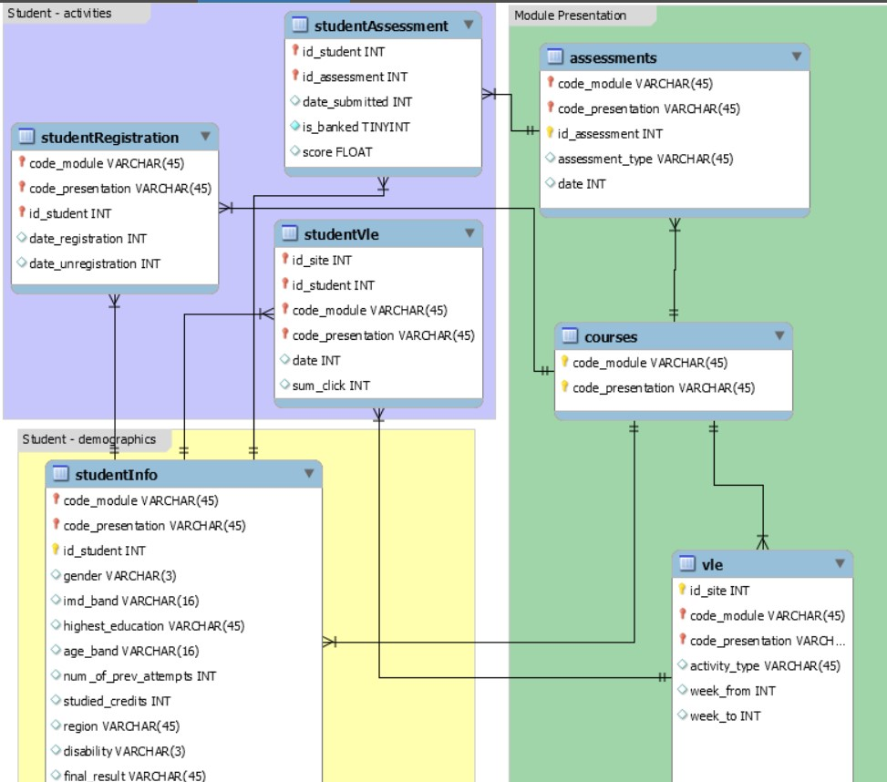
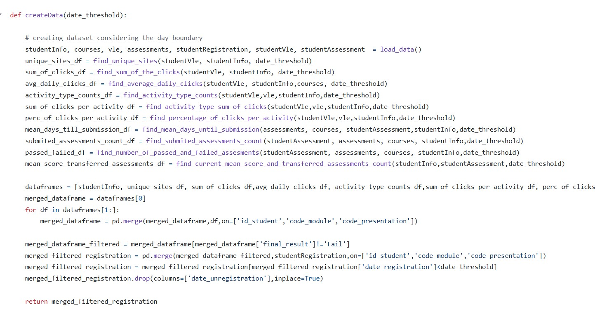
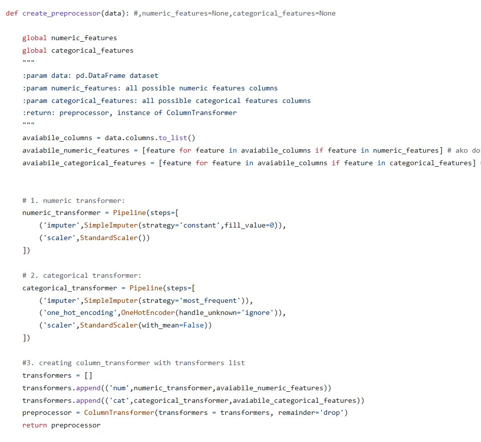
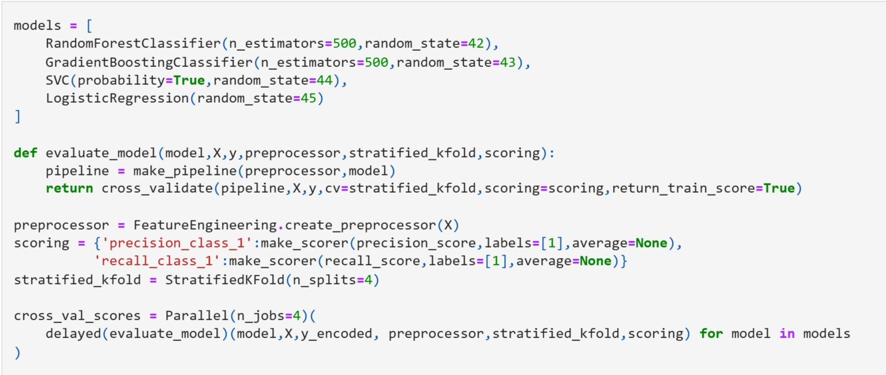
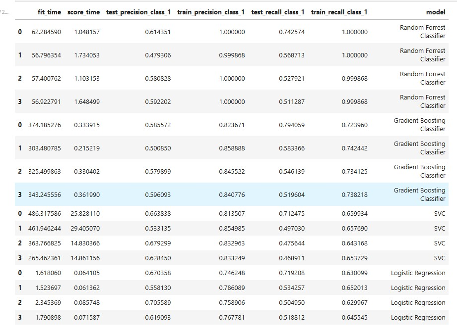
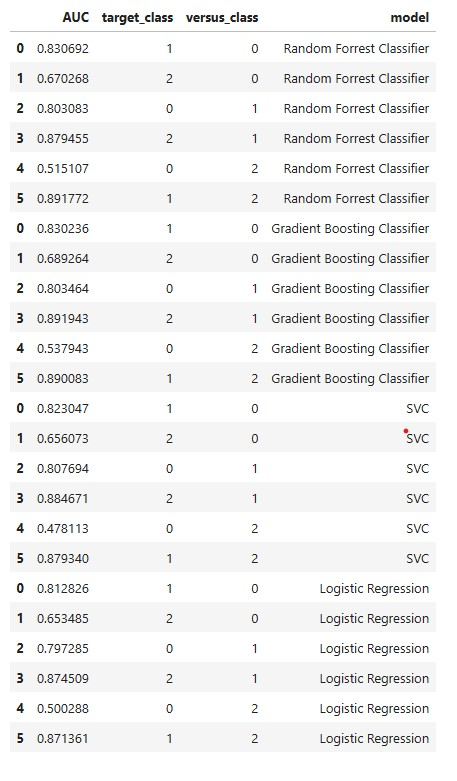

### Students withdrawal prediction 
You are given a dataset with students and all their interactions with a virtual learning environment 
in the form of .csv files corresponding to relational database tables. Data is avaiable [here](https://drive.google.com/drive/folders/1KcRByLZcyVb1Dx4em4XEc9W9thMBVLGV)

**The goal** is to predict with what **precision and recall** we can predict which students will drop out of the course. 
The **dataset is variable**, depending on the *number of days* the user inputs into the **create_dataset method**.
**Output variable is described by 3 categorical values explaining students final status:**
1. Pass - a student has passed the course;
2. Withdrawn - a student has drop out of the course;
3. Distinction - a student has completed the course with excellent results.

### Database schema:

### Data explanation: 
1. **courses.csv** - File contains the list of all available modules and their presentations.
2. **assessments.csv** - This file contains information about assessments in module-presentations.
3. **vle.csv** - The csv file contains information about the available materials in the VLE. Typically these are html pages,
pdf files, etc. Students have access to these materials online and their interactions with the materials are recorded.
4. **studentInfo.csv** - This file contains demographic information about the students together with their results.
5. **studentRegistration.csv** - This file contains information about the time when the student registered for the module presentation.
For students who unregistered the date of unregistration is also recorded.
6. **studentAssessments.csv** - This file contains the results of students’ assessments. If the student does not submit the assessment, no result is recorded.
The final exam submissions is missing, if the result of the assessments is not stored in the system.
7. **studentVle.csv** - The studentVle.csv file contains information about each student’s interactions with the materials in the VLE.

   ### Feature Engineering:
   In the **FeatureEngineering.py** file, there are methods that aggregate data from .csv files to standardize them at a suitable level of abstraction for applying predictive models.
   Feature engineering involves aggregating data such as *activity_type_counts, sum_of_clicks, sum_of_clicks_per_activity, mean_days_until_submission, submitted_assessments_count, number_of_failed_assessments*...
   All methods that create individual attributes are called in the main method **create_dataset**, which takes a date_threshold parameter and filters the dataset up to the specified day of the course.

   **Method that creates the dataset on which the model is applied:**

   

   ### Transforming data with ColumnTransformer + Filling NaNs:
   

In the **notebook.ipynb** file, a method is called to create a dataset with a 15-day threshold. 
A pipeline is created to measure precision and recall for the **'Withdrawn'** class using various classification models:
**Random Forest Classifier, Gradient Boosting Classifier, SVC, and Logistic Regression**. K-fold cross-validation with k=4 is also utilized.

### Results of cross validation for class Withdrawn: 

### AUC score for distinction between different classes evaluated by different classification models:

   
